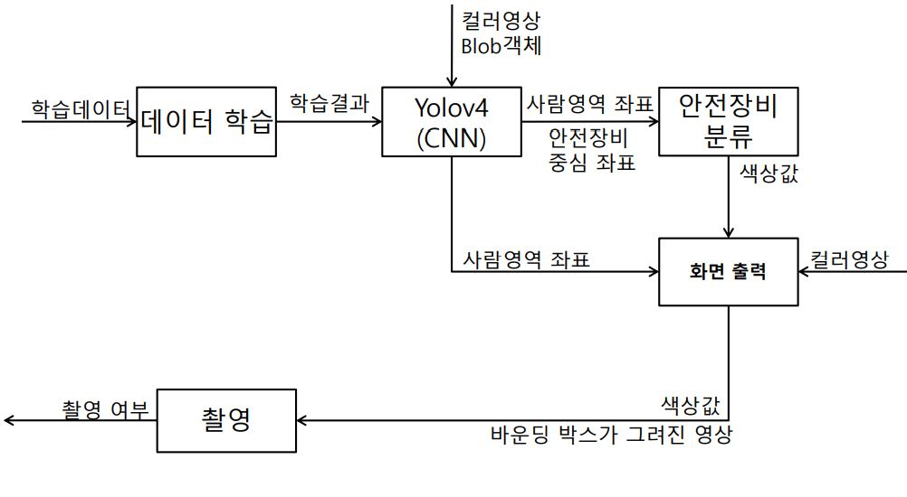

# ⏰ Divide Equipment 안전 장비 분류

22년도 2학기 IT정보제어공학과 스마트비전 기말 프로젝트  
안전 장비를 분류하여 위험도에 따라 색을 분류하고 촬영하는 프로그램
---
  
* #### :computer: Environment
  * Language: C++
  * IDE: Visual Studio
  * Yolov4 / Darknet / OpenCV / YoloLabel
  * Developer: 김주하
  
  
* #### 💡 Data Set
  * Class Num: 5
  * Class Name: Person, Helmet, Vest, Boots, Glove
  * Batch / Subdivision: 64 / 32
  * Max_Batches / Step: 15000 / 12000, 13500
  * Filters: 30
  * Width & Height: 320
  * Number of dataset: About 1000 pictures

  
---


<!-------------------------------------------------------------Part 1------------------------------------------------------------------------------------------>

 ## 1. 블록도 설명

  
  

 1. __데이터 학습 및 추론__  
    * YoloLabel로 라벨링된 데이터를 다크넷으로 학습시킴   
    * 예측 완료된 객체 정보를 person 안의 안전 장비를 분류하는 함수로 보냄

    
 2. __안전 장비 분류__    
    * 내부 안전 장비에 따라서 색상을 분류함
    * 분류 결과를 저장하여 촬영 함수에서 사용할 수 있도록 함
    
    
 3. __화면 출력__    
    * 분류된 결과에 따라 바운딩 박스가 그려진 화면을 출력함
    
    
---


<!-------------------------------------------------------------Part 2------------------------------------------------------------------------------------------>

 ## 2. 코드 설명
 ### 입실 버튼 부분</br>
  * 다음과 같은 코드로 서버에 저장되어 있는 좌석을 키오스크에서 판별함  
  
       ```python
        conn = mc.connect(host=host, user=username, password=password, db=database, charset='utf8', port=port1)
        cur = conn.cursor()
        sql = "SELECT 좌석유무 FROM 테스트 WHERE 좌석번호 = %s"

        with conn:
            with conn.cursor() as cur:
                cur.execute(sql, (1,))  # n번 좌석의 좌석유무 확인
                result = cur.fetchall()

                for data in result:
                    if data == ('유',):
                        self.pButton_1.setText("1번 좌석\n사용중")
                        self.pButton_1.setStyleSheet("background-color: gainsboro")
                        self.pButton_1.setDisabled(True)
                    if data == ('무',):
                        self.pButton_1.setText("1번 좌석")
                        self.pButton_1.setStyleSheet("background-color:#eb9f9f")  # 기본 회색
                        self.pButton_1.clicked.connect(self.whktjr1)
             ..........

        def whktjr1(self):
             text1='1'
             self.sw=time_1(text1,'1')  # 시간제 선택 윈도우에 좌석 정보 보냄
             self.sw.exec_()
             self.hide() 
             self.second = time_1()  # 시간제 선택 윈도우로 전환 
             self.second.exec() 
             self.showMaximized()  

       ```
### 시간제 선택 부분</br>
  * 다음과 같은 코드로 선택된 아이템에 대한 시간과 가격을 계산함
  
       ```python 
        def item_clicked(self, item):
          self.item_selected.append(item)
          self.item_show()
          totaltime = int(self.totaltime.text())
          total = int(self.totalPrice.text())

          self.totaltime.setText(str(totaltime + ITEM_INFO[self.item_selected[-1]]['time']))
          self.totalPrice.setText(str(total + ITEM_INFO[self.item_selected[-1]]['price']))
       ```
   * 다음과 같은 코드로 좌석, 총 결제금액, 총 시간을 '결제 부분'으로 보냄  
  
       ```python 
        def item_pay(self):
           global pay_success
           #self.hide()
           paytime=int(self.totaltime.text())
           payprice =int(self.totalPrice.text())
           text1= int(self.label_s.text())

           if self.label_5.text() == '1':
               self.payto = paytoWindow(payprice,paytime,text1)
               self.payto.exec()
               pay_success = False
           elif self.label_5.text() == '2':
               self.exto = paytoex(payprice,paytime,text1)
               self.exto.exec()
               pay_success = False

          if pay_success:
              self.item_clearall()
          self.show()
       ```
